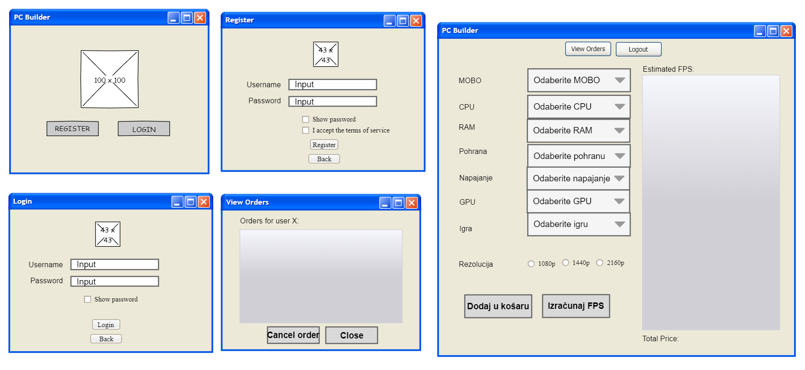
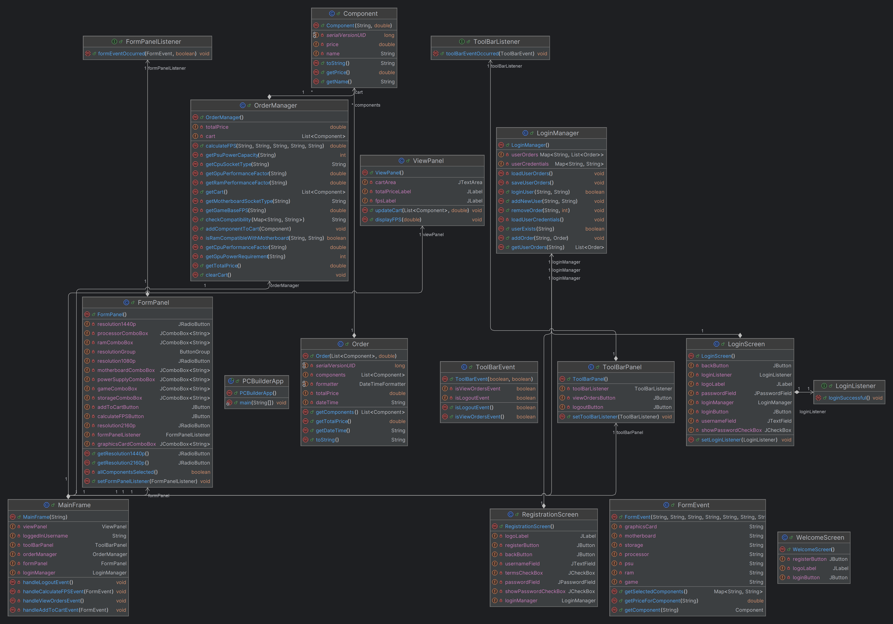

# Dokumentacija za aplikaciju PC Builder

Ovdje možete pristupiti [JavaDoc dokumentaciji](https://karlolerga.github.io/FinalniProjekt/) za Finalni Projekt.


## Opis problema


Cilj ovog projekta je izraditi desktop aplikaciju pod nazivom **PC Builder**. Aplikacija je osmišljena kako bi pomogla korisnicima da slože vlastita računala odabirom različitih komponenti poput matične ploče, procesora (CPU), radne memorije (RAM), grafičke kartice (GPU), pohrane (storage) i napajanja (PSU). Dodatno, aplikacija izračunava procijenjene performanse u igrama kroz broj sličica po sekundi (FPS) na temelju odabranih komponenti i rezolucije.


### Ključne funkcionalnosti:
1. **Odabir komponenti**: Korisnici mogu birati između raznih komponenti poput matične ploče, procesora, RAM-a, grafičke kartice, pohrane i napajanja.
2. **Upravljanje košaricom**: Korisnici mogu dodavati komponente u košaricu, a aplikacija izračunava ukupnu cijenu odabranih komponenti.
3. **Provjera kompatibilnosti**: Aplikacija provjerava kompatibilnost između odabranih komponenti (npr. kompatibilnost socketa između procesora i matične ploče, ili dovoljna snaga napajanja za grafičku karticu).
4. **Procjena performansi**: Na temelju odabranih komponenti, korisnici mogu izračunati procijenjeni FPS za igre na različitim rezolucijama (1080p, 1440p, 2160p).
5. **Autentifikacija korisnika**: Korisnici se mogu prijaviti, pregledavati svoje narudžbe i stvarati nove. Postoji i sustav registracije za nove korisnike.
6. **Povijest narudžbi**: Korisnici mogu pregledati svoje prošle narudžbe, ukloniti ih po potrebi ili pregledati svoje odabire komponenti.
7. **Odjava i upravljanje sesijom**: Aplikacija omogućava upravljanje korisničkim sesijama i odjavu.


## Pregled rješenja


Kako bi se postigla tražena funkcionalnost, aplikacija je podijeljena na različite komponente, gdje svaka komponenta ima određene odgovornosti. Dizajn slijedi obrazac **Model-View-Controller (MVC)**, osiguravajući da svaki dio programa ima jasno definiranu ulogu i odgovornost. Aplikacija je izrađena korištenjem **Java Swing** biblioteke za korisničko sučelje te standardnih Java biblioteka za logiku i upravljanje podacima.


### Konceptualni model rješenja:


- **Model**: 
  - **Component**: Predstavlja pojedinačnu komponentu računala (matična ploča, CPU, RAM itd.). Sadrži naziv i cijenu komponente.
  - **Order**: Predstavlja korisničku narudžbu, koja sadrži listu komponenti i ukupnu cijenu.
  - **FormEvent**: Pohranjuje podatke forme u kojoj korisnik odabire komponente.
  - **LoginManager**: Upravljanje autentifikacijom korisnika i korisničkim podacima.
  - **OrderManager**: Upravljanje košaricom korisnika, provjera kompatibilnosti komponenti i izračun FPS-a za igre.


- **View (Pogled)**:
  - **WelcomeScreen**: Početni ekran aplikacije koji omogućuje korisnicima prijavu ili registraciju.
  - **LoginScreen**: Rukuje prijavom korisnika.
  - **RegistrationScreen**: Rukuje registracijom novih korisnika.
  - **MainFrame**: Glavni prozor u kojem korisnici mogu birati komponente, pregledavati košaricu i izvršiti narudžbe.
  - **FormPanel**: Panel gdje korisnici biraju PC komponente.
  - **ViewPanel**: Prikazuje komponente koje je korisnik odabrao, ukupnu cijenu i procjenu FPS-a.
  - **ToolBarPanel**: Alatna traka s opcijama za pregled narudžbi i odjavu.


- **Controller (Kontroler)**:
  - Kontroler je implicitno rukovan pomoću **event listenera** pridruženih GUI komponentama. Ovi listeneri obrađuju korisničke akcije poput klikanja na gumbe te ažuriraju pogled ili model u skladu s tim.

# Opis wireframeova korisničkog sučelja za PC Builder

Priloženi wireframeovi prikazuju osnovne ekrane korisničkog sučelja aplikacije **PC Builder**. Opis svakog ekrana objašnjava glavne funkcionalnosti i elemente sučelja koje korisnik može koristiti.



## 1. Welcome Screen (Ekran dobrodošlice)

**Opis:**
- Ovaj ekran omogućuje korisnicima izbor između registracije ili prijave.  
- Prikazana su dva velika gumba: **REGISTRACIJA** i **PRIJAVA**, što korisniku pruža jednostavan način za početak interakcije s aplikacijom.

**Elementi:**
- Logo aplikacije ili grafički prikaz (mjesto za sliku ili logotip).
- Gumb "Registracija".
- Gumb "Prijava".

---

## 2. Register Screen (Ekran za registraciju)

**Opis:**
- Ekran za registraciju omogućuje unos korisničkog imena i lozinke te opciju prikazivanja lozinke.
- Korisnik mora prihvatiti uvjete korištenja prije registracije.
- Tu je i mogućnost povratka na prethodni ekran.

**Elementi:**
- Polje za unos korisničkog imena.
- Polje za unos lozinke.
- Potvrdna kućica za prikaz lozinke.
- Potvrdna kućica za prihvaćanje uvjeta korištenja.
- Gumb "Registracija".
- Gumb "Povratak".

---

## 3. Login Screen (Ekran za prijavu)

**Opis:**
- Ovaj ekran služi za prijavu korisnika u aplikaciju. Omogućuje unos korisničkog imena i lozinke te opciju prikazivanja lozinke.
- Korisnik se može vratiti na prethodni ekran putem gumba "Povratak".

**Elementi:**
- Polje za unos korisničkog imena.
- Polje za unos lozinke.
- Potvrdna kućica za prikaz lozinke.
- Gumb "Prijava".
- Gumb "Povratak".

---

## 4. Main PC Builder Screen (Glavni ekran za odabir komponenti)

**Opis:**
- Ovo je glavni ekran aplikacije gdje korisnici mogu odabrati različite komponente za sastavljanje svog računala.
- Korisnik bira između različitih komponenti (matična ploča, CPU, RAM, itd.) koristeći padajuće izbornike.
- Ekran također omogućuje odabir rezolucije i prikazuje procijenjeni broj sličica po sekundi (FPS) na temelju odabranih komponenti.
- Dostupne su i opcije za dodavanje odabranih komponenti u košaricu i izračunavanje FPS-a.

**Elementi:**
- Padajući izbornici za odabir različitih komponenti (matična ploča, CPU, RAM, pohrana, napajanje, GPU, igra).
- Radio gumbi za odabir rezolucije (1080p, 1440p, 2160p).
- Gumb "Dodaj u košaricu".
- Gumb "Izračunaj FPS".
- Prikaz procijenjenog FPS-a.
- Prikaz ukupne cijene odabranih komponenti.
- Gumbi "Pregled narudžbi" i "Odjava".

---

## 5. View Orders Screen (Ekran za pregled narudžbi)

**Opis:**
- Ovaj ekran prikazuje korisniku sve narudžbe koje je prethodno izvršio. Korisnik može pregledavati narudžbe i odlučiti obrisati neku od njih.
- Također postoji mogućnost zatvaranja prozora i vraćanja na glavni ekran.

**Elementi:**
- Prikaz narudžbi korisnika.
- Gumb "Otkaži narudžbu".
- Gumb "Zatvori".

---

## Zaključak

Ovi wireframeovi jasno prikazuju kako će aplikacija **PC Builder** omogućiti korisnicima interakciju s različitim funkcionalnostima poput registracije, prijave, odabira komponenti i upravljanja narudžbama. Fokus sučelja je na jednostavnosti i lakoći korištenja, omogućujući korisnicima brzo i efikasno obavljanje zadataka.

## Dijagram klasa aplikacije PC Builder

Dijagram klasa aplikacije PC Builder prikazuje odnose i funkcionalnosti između različitih komponenti desktop aplikacije usmjerene na sastavljanje prilagođenih PC konfiguracija, upravljanje korisničkim narudžbama i autentifikaciju korisnika.


### Ključne komponente:

### 1. PCBuilderApp (Glavna klasa)
- Središnja klasa aplikacije odgovorna za pokretanje aplikacije.
- Sadrži metodu `main()`, koja je početna točka programa.
- Pokreće ekran dobrodošlice ili inicira proces prijave/registracije.

### 2. OrderManager
- Upravljanje narudžbama i operacijama povezanim s njima.
- **Ključne odgovornosti:**
  - `calculateFPS`: Izračunava FPS (sličice po sekundi) na temelju odabranih komponenti i rezolucije.
  - `processComponent`: Rukuje obradom niza koji predstavlja komponentu.
  - `getOrderList`: Dohvaća popis komponenti u narudžbi.
  - `checkCompatibility`: Provjerava kompatibilnost komponenti poput tipa socketa za procesore i matične ploče.
  - `getTotalPrice`: Izračunava ukupnu cijenu odabranih komponenti.
  - `clearCart()`: Prazni korisničku košaricu.

### 3. Order (Narudžba)
- Predstavlja pojedinačnu narudžbu korisnika.
- **Atributi:**
  - Popis komponenti (Lista objekata **Component**).
  - `totalPrice`: Ukupna cijena svih odabranih komponenti.
  - `orderDateTime`: Datum i vrijeme kada je narudžba napravljena.
- **Metode:**
  - `getTotalPrice()`: Vraća ukupnu cijenu narudžbe.
  - `getDateTime()`: Dohvaća datum i vrijeme narudžbe.
  - `toString()`: Formatira detalje narudžbe u oblik niza.

### 4. Component (Komponenta)
- Predstavlja jednu komponentu računala (npr. CPU, matična ploča, GPU itd.).
- **Atributi:**
  - `name`: Naziv komponente.
  - `price`: Cijena komponente.
- **Metode:**
  - `getName()`: Dohvaća naziv komponente.
  - `getPrice()`: Dohvaća cijenu komponente.

### 5. LoginManager
- Upravljanje sustavom prijave korisnika i autentifikacijom.
- **Ključne odgovornosti:**
  - Rukuje korisničkim vjerodajnicama (koristi **Map** za `userCredentials`).
  - Upravljanje korisničkim narudžbama i njihovom povijesti (koristi **Map** za `userOrders`).
  - Provodi provjeru prijave kroz metode poput `userExists()` i `isPasswordCorrect()`.
  - Upravljanje spremanjem i učitavanjem korisničkih vjerodajnica i narudžbi.

### 6. LoginScreen (Ekran za prijavu)
- Upravljanje korisničkim sučeljem (UI) za prijavu.
- **UI elementi:**
  - `loginButton`, `passwordField`, `loginListener`: Rukuje korisničkim akcijama prilikom prijave.
  - Koristi **LoginManager** za validaciju vjerodajnica.

### 7. RegistrationScreen (Ekran za registraciju)
- Omogućuje novim korisnicima registraciju u aplikaciji.
- **UI komponente:**
  - `registrationField`: Forma za unos podataka za registraciju.
  - Čekboks za prikaz lozinke.
  - Gumbi za navigaciju poput `registerButton`.

### 8. MainFrame (Glavni okvir)
- Glavni prozor aplikacije gdje korisnici mogu koristiti većinu funkcionalnosti.
- **UI komponente:**
  - **FormPanel**: Panel na kojem korisnici mogu birati PC komponente.
  - **ViewPanel**: Prikazuje sažetak odabranih komponenti, ukupnu cijenu i procijenjeni FPS.
  - **ToolBarPanel**: Omogućuje korisnicima pristup radnjama poput pregleda narudžbi i odjave.

### 9. FormPanel
- Namjenski panel za korisnike gdje mogu birati komponente za izradu prilagođenog PC-a.
- **UI komponente:**
  - Razni **JRadioButton** i **JComboBox** elementi za odabir specifičnih tipova komponenti (rezolucija, CPU, GPU, matična ploča itd.).
- **Event Listeneri:**
  - **FormPanelListener**: Rukuje događajima koji su pokrenuti odabirom komponenata i prosljeđuje ih **OrderManageru**.

### 10. ViewPanel
- Prikazuje sažetak korisničkog odabira PC komponenti.
- **UI komponente:**
  - `totalPriceLabel`: Prikazuje ukupnu cijenu odabranih komponenti.
  - `displayFPS`: Metoda za prikaz izračunatog FPS-a na temelju komponenti i rezolucije.

### 11. ToolBarPanel
- Omogućuje korisnicima opcije upravljanja, poput pregleda narudžbi i odjave.
- **Ključni gumbi:**
  - `logOutButton`
  - `viewOrdersButton`
- **Upravljanje događajima:**
  - Koristi **ToolBarListener** za upravljanje događajima na alatnoj traci.

### 12. ToolBarEvent
- Rukuje specifičnim događajima koji su pokrenuti gumbima na alatnoj traci, poput pregleda narudžbi ili odjave.

### 13. FormEvent
- Predstavlja model podataka za odabir komponenti.
- Pohranjuje odabrane komponente iz forme, kao i dodatne informacije poput odabrane rezolucije i izračuna FPS-a.

### 14. LoginListener
- Sluša za akcije prijave i provjerava korisničke vjerodajnice koristeći **LoginManager**.
- Uključuje metodu `loginSuccess()` za pokretanje akcija kad prijava uspije.

### 15. FormPanelListener
- Sluša događaje iz forme pokrenute korisničkim odabirom komponenata.
- Prosljeđuje te događaje **OrderManageru** na obradu.

### 16. WelcomeScreen (Ekran dobrodošlice)
- Početni ekran aplikacije koji omogućuje korisnicima prijavu ili registraciju.
- **UI komponente:**
  - `loginButton` i `registerButton`: Preusmjeravaju korisnike na odgovarajuće ekrane.

### Odnosi:

- **PCBuilderApp** djeluje kao ulazna točka aplikacije, pokrećući aplikaciju i povezujući se s glavnim sučeljima kao što su **WelcomeScreen** i **MainFrame**. Ova klasa inicijalizira aplikaciju i omogućava korisnicima da započnu s radom.

- **OrderManager** upravlja svim aspektima narudžbi, od provjere kompatibilnosti komponenti do izračuna FPS-a i ukupne cijene. **OrderManager** je izravno povezan s klasama **Order**, **FormPanel**, i **ViewPanel** jer mora primati podatke o odabranim komponentama iz forme i prikazivati informacije o cijeni i performansama u sučelju.

- **Order** služi kao model podataka za narudžbu, čuvajući popis odabranih komponenti i relevantne informacije o narudžbi poput ukupne cijene i vremena narudžbe. **OrderManager** koristi **Order** kako bi manipulirao i upravljao narudžbom.

- **LoginManager** je odgovoran za autentifikaciju i upravljanje korisničkim vjerodajnicama. Povezan je s klasama **LoginScreen** i **RegistrationScreen**, gdje se vjerodajnice unose, te s **LoginListener** koji pokreće provjere i akcije prijave.

- **MainFrame** služi kao glavni okvir aplikacije koji organizira sve važne funkcionalnosti aplikacije kroz panele kao što su **FormPanel**, **ViewPanel**, i **ToolBarPanel**. Unutar ovog okvira, korisnici mogu odabrati komponente, vidjeti cijene, pregledati narudžbe i odjaviti se iz sustava.

- **FormPanel** i **ViewPanel** su usko povezani s **OrderManagerom** jer su odgovorni za unos i prikaz podataka o narudžbi. **FormPanelListener** šalje korisničke odabire komponenti **OrderManageru**, koji tada obrađuje informacije i vraća podatke o cijeni i performansama za prikaz u **ViewPanelu**.

- **ToolBarPanel** omogućuje korisnicima navigaciju kroz aplikaciju, uključujući pregled narudžbi i opciju odjave. Povezan je s **ToolBarListenerom** koji upravlja događajima unutar alatne trake.

- **FormEvent** i **FormPanelListener** omogućuju prenošenje događaja iz sučelja prema **OrderManageru**, gdje se ti podaci obrađuju za daljnju logiku narudžbi.


Ovaj dijagram klasa pruža sveobuhvatan prikaz odnosa između različitih komponenti aplikacije PC Builder. **MVC obrazac** dizajna je očit, s jasnom podjelom između modela (npr. **OrderManager**, **Component**, **Order**), prikaza (npr. **FormPanel**, **ViewPanel**, **ToolBarPanel**) i kontrolera (npr. **FormPanelListener**, **ToolBarListener**).


## Biblioteke i paketi korišteni:
Ovaj projekt koristi sljedeće Java pakete i biblioteke:


1. **Java Swing**:
   - Koristi se za izgradnju grafičkog korisničkog sučelja (GUI).
   - Osigurava komponente poput `JFrame`, `JButton`, `JLabel`, `JTextArea` itd.
   - **Namjena**: Omogućuje korisnicima interakciju s aplikacijom putem grafičkog sučelja.


2. **Java I/O (Input/Output)**:
   - Klase poput `FileReader`, `BufferedReader`, `ObjectOutputStream`, `ObjectInputStream` koriste se za rukovanje datotekama.
   - **Namjena**: Čitanje i pisanje korisničkih vjerodajnica i narudžbi u/iz datoteka, što omogućuje trajnost podataka.
   - **Datoteke s podacima**: 
     - `users.txt` – Pohranjuje vjerodajnice korisnika.
     - `orders.txt` – Pohranjuje serijalizirane podatke narudžbi za svakog korisnika.


3. **Java Collections Framework**:
   - Kolekcije poput `HashMap`, `List`, `ArrayList` koriste se za pohranu i upravljanje podacima.
   - **Namjena**: Upravljanje korisničkim vjerodajnicama, narudžbama i odabirima komponenti na organiziran i učinkovit način.


## Vanjske biblioteke i paketi
Ova aplikacija ne koristi vanjske biblioteke osim standardnih Java SDK biblioteka.


### Linkovi na Java dokumentaciju:
- **Java Swing**: [https://docs.oracle.com/javase/tutorial/uiswing/](https://docs.oracle.com/javase/tutorial/uiswing/)
- **Java I/O**: [https://docs.oracle.com/javase/8/docs/api/java/io/package-summary.html](https://docs.oracle.com/javase/8/docs/api/java/io/package-summary.html)
- **Java Collections Framework**: [https://docs.oracle.com/javase/8/docs/technotes/guides/collections/](https://docs.oracle.com/javase/8/docs/technotes/guides/collections/)


## Kako pokrenuti aplikaciju


1. **Preduvjeti**:
   - Java Development Kit (JDK) verzije 8 ili novije mora biti instaliran na vašem sustavu.


2. **Kompajliranje koda**:
   - Idite u mapu projekta gdje se nalazi datoteka `PCBuilderApp.java`.
   - Kompajlirajte Java datoteke koristeći sljedeću naredbu u terminalu:
     ```bash
     javac -d bin src/main/java/app/*.java src/main/java/ui/*.java src/main/java/event/*.java src/main/java/manager/*.java src/main/java/model/*.java
     ```
     Ova naredba će kompajlirati sve potrebne `.java` datoteke i smjestiti generirane `.class` datoteke u direktorij `bin`.


3. **Pokretanje aplikacije**:
   - Pokrenite kompajliranu aplikaciju koristeći sljedeću naredbu:
     ```bash
     java -cp bin app.PCBuilderApp
     ```


## Upravljanje podacima
Aplikacija koristi jednostavan sustav za upravljanje podacima putem datoteka za pohranu korisničkih vjerodajnica i narudžbi.


- **Datoteka s korisnicima (`users.txt`)**:
  - Format: `korisničko_ime,lozinka`
  - Primjer unosa: 
    ```
    john_doe,password123
    ```


  
- **Datoteka s narudžbama (`orders.txt`)**:
  - Ova datoteka pohranjuje serijalizirane objekte narudžbi koji uključuju odabrane komponente i ukupnu cijenu.


## Moguća poboljšanja u budućnosti


1. **Integracija baze podataka**:
   - Umjesto korištenja tekstualnih datoteka, integracija baze podataka poput MySQL-a ili SQLite-a za upravljanje korisnicima i narudžbama bi poboljšala skalabilnost i sigurnost.


2. **Poboljšana provjera kompatibilnosti**:
   - Trenutna provjera kompatibilnosti može se unaprijediti dodavanjem složenijih scenarija, poput provjere kompatibilnosti kućišta i matične ploče ili upravljanja termalnim opterećenjima.


3. **Integracija s oblakom**:
   - Dodavanje pohrane podataka u oblaku omogućilo bi korisnicima pristup aplikaciji s više uređaja.


4. **Poboljšanje izračuna FPS-a**:
   - Dodavanje više igara i detaljnijih performansnih metrika temeljenih na stvarnim benchmark testovima za bolju procjenu FPS-a.


Ova dokumentacija pruža sveobuhvatan pregled aplikacije PC Builder, njen dizajn, način korištenja i potencijalna poboljšanja za buduće verzije.
